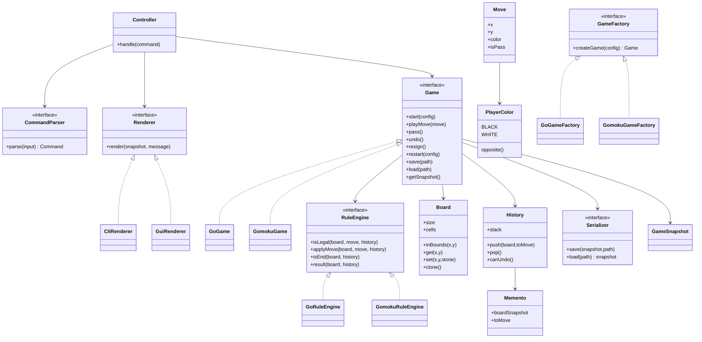
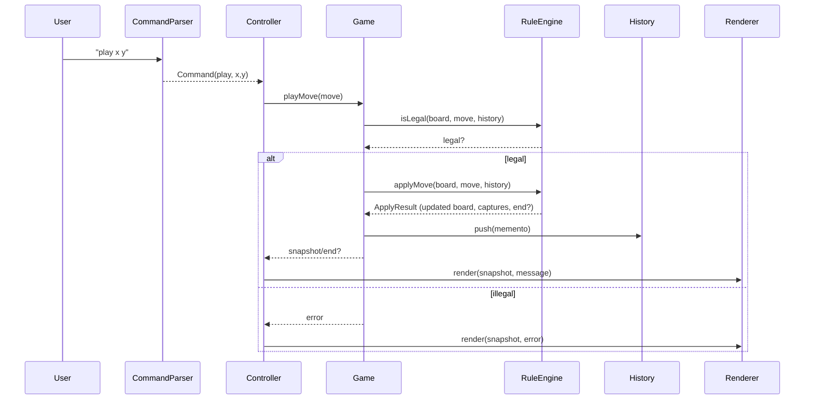

# 棋类对战平台 领域建模与架构分层

## 领域概念与职责
- Game（抽象）：组织一局对战的生命周期（start/play/undo/save/load/restart/resign/pass），维护行棋方与历史，不关心具体规则细节。
- GoGame / GomokuGame：具体游戏实现，使用对应规则引擎与判定逻辑。
- Board：棋盘状态（尺寸、格子占用、坐标合法性）；提供放置/移除棋子、获取链、复制快照；不处理输入或胜负判断。
- Move：一步操作的数据（坐标、玩家、是否 pass）；供历史/悔棋/存档使用。
- Player / Color：玩家标识与执子颜色，负责切换行棋方。
- RuleEngine（抽象）：判定落子合法性、局面更新、终局检测与胜负计算；不做 IO。
- GoRuleEngine / GomokuRuleEngine：围棋提子、数子判胜、虚着；五子连五判胜、满盘平局。
- Serializer：局面与历史的持久化（save/load）；定义格式与校验。
- CommandParser：将用户输入解析为内部命令或动作对象。
- Controller / GameService：协调 UI 与 Game，处理命令、错误反馈、状态同步。
- Renderer（CLI / GUI）：呈现棋盘、提示与反馈；不直接修改领域状态。
- Memento / History：保存可恢复的局面快照，支持悔棋与存档。

## 可变点 vs 稳定点
- 可变：规则合法性判定、终局/胜负计算、落子后更新逻辑、默认棋盘尺寸、显示方式（CLI/GUI）、存档格式。
- 稳定：棋盘坐标体系、行棋方交替、历史记录栈模型、命令集合（start/play/pass/undo/resign/restart/save/load/hint）。

## 分层与依赖方向
- 表现层：CommandParser、Renderer（CLI/GUI）；依赖 Controller 接口，不直接操作 Board。
- 应用/协调层：Controller/GameService，调度 Game、处理错误和提示，将结果交给 Renderer。
- 领域层：Game 抽象与具体子类、RuleEngine 及实现、Board、Move、History/Memento、Player/Color。
- 基础设施：Serializer（文件 IO）、可选 GUI 适配器。
- 依赖只向下：表现层 -> 应用层 -> 领域层 -> 基础设施；领域层不依赖具体 UI。

## 关键接口/协作骨架（示意）
- Game：`start(config)`、`playMove(move)`、`pass()`、`undo()`、`resign()`、`restart(config)`、`save(path)`、`load(path)`、`getStateSnapshot()`
- RuleEngine：`isLegal(board, move)`、`applyMove(board, move)`、`isEnd(board, history)`、`result(board)`（返回胜负/平局信息）
- Serializer：`save(snapshot, path)`、`load(path) -> snapshot`
- Controller：`handle(command)`，内部调用 Game/Serializer/Renderer。
- Renderer：`render(snapshot, messages)`；CommandParser：`parse(input) -> command`

## 设计模式落位（基于可变点）
- 工厂/抽象工厂：根据选择创建 Go/Gomoku 的 Game + RuleEngine + Serializer + Renderer 组合。
- 策略：RuleEngine 作为规则策略，可替换围棋/五子棋实现。
- 模板方法：Game 定义回合流程骨架，具体规则由 RuleEngine 钩子完成。
- 备忘录：History/Memento 保存局面快照，支持悔棋和存档。
- 状态（可选）：管理未开始/进行中/结束状态限制可用命令。
- 观察者（可选）：UI 订阅状态变化，刷新显示（尤其 GUI）。

## 典型场景协作（简述）
- 一次落子：CommandParser -> Controller(handle) -> Game.playMove -> RuleEngine.isLegal/applyMove -> 更新 History/Memento -> Renderer.render 反馈。
- 悔棋：Controller -> Game.undo -> 从 History 恢复 snapshot -> Renderer.render。
- 保存/读取：Controller -> Game.save/load（内部用 Serializer）-> Renderer 反馈。
- 双 pass/终局：Game 调 RuleEngine.isEnd/ result，Renderer 输出胜负。

## 设计模式选型与落地
- 抽象工厂 + 工厂方法：GameFactory 负责创建 Game + RuleEngine + Serializer + Renderer 组合，派生 GoGameFactory、GomokuGameFactory。
- 策略：RuleEngine 抽象封装规则算法，GoRuleEngine / GomokuRuleEngine 可互换；胜负计算/合法性判定作为内部策略方法。
- 模板方法：Game 抽象定义对局流程骨架（playMove/pass/undo/save/load/restart），具体行为委托 RuleEngine；Controller 可用模板方法处理通用命令流程。
- 备忘录：History/Memento 保存 Board 快照和行棋方，支持 undo/save/load 恢复。
- 状态（可选）：GameState（未开始/进行中/已结束）决定可用命令，避免条件分支膨胀。
- 观察者（可选）：Renderer 订阅 Game 状态变化（尤其 GUI），或通过事件分发更新显示。

## 关键类与接口设计（草案）
```text
interface Game {
  void start(GameConfig config);
  void playMove(Move move);   // 落子
  void pass();                // 围棋虚着
  void undo();                // 悔棋一步
  void resign();              // 认输
  void restart(GameConfig config);
  void save(String path);
  void load(String path);
  GameSnapshot getSnapshot(); // 给 UI 或存档使用
}

class GoGame implements Game { RuleEngine engine = new GoRuleEngine(); ... }
class GomokuGame implements Game { RuleEngine engine = new GomokuRuleEngine(); ... }

interface RuleEngine {
  boolean isLegal(Board board, Move move, History history);
  ApplyResult applyMove(Board board, Move move, History history); // 更新棋盘/提子/连五检查
  boolean isEnd(Board board, History history);
  GameResult result(Board board, History history);
}

class Board {
  int size;
  Stone[][] cells;
  boolean inBounds(int x, int y);
  Stone get(int x, int y);
  void set(int x, int y, Stone stone);
  Board clone(); // 支持快照
}

class Move { int x, y; PlayerColor color; boolean isPass; }
enum PlayerColor { BLACK, WHITE; PlayerColor opposite(); }

class History {
  Stack<Memento> stack;
  void push(Board board, PlayerColor toMove);
  Memento pop();
  boolean canUndo();
}
class Memento { Board boardSnapshot; PlayerColor toMove; }

interface Serializer {
  void save(GameSnapshot snapshot, String path);
  GameSnapshot load(String path);
}

interface Renderer { void render(GameSnapshot snapshot, Message msg); }
class CliRenderer implements Renderer { ... }
// GUI 版本可选：GuiRenderer

interface CommandParser { Command parse(String input); }
class Controller {
  Game currentGame;
  Renderer renderer;
  void handle(Command cmd); // 解析结果传入，调用 Game，捕获错误再反馈
}

// 工厂
interface GameFactory { Game createGame(GameConfig config); }
class GoGameFactory implements GameFactory { ... }
class GomokuGameFactory implements GameFactory { ... }
```

### 说明
- Game 聚合 RuleEngine、Board、History、Serializer；模板方法用于约束流程，RuleEngine 处理规则差异。
- History/Memento 既供 undo 也供 save/load；Serializer 读写 GameSnapshot（包含棋盘、行棋方、历史）。
- Renderer/CommandParser 面向 UI 层；Controller 作为应用服务协调命令与反馈。
- 可选 State/Observer 可在实现时再细化：State 控制命令可用性；Observer 用于 GUI 自动刷新。 

## UML（Mermaid）

### 类图（核心关系）


### 时序图（一次落子）

